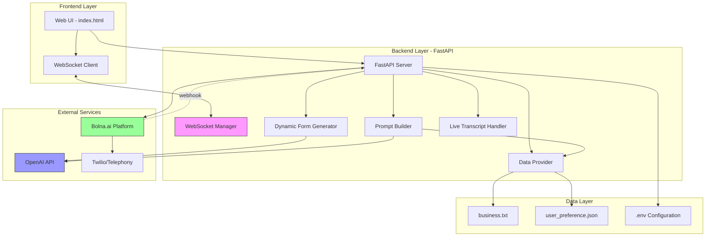
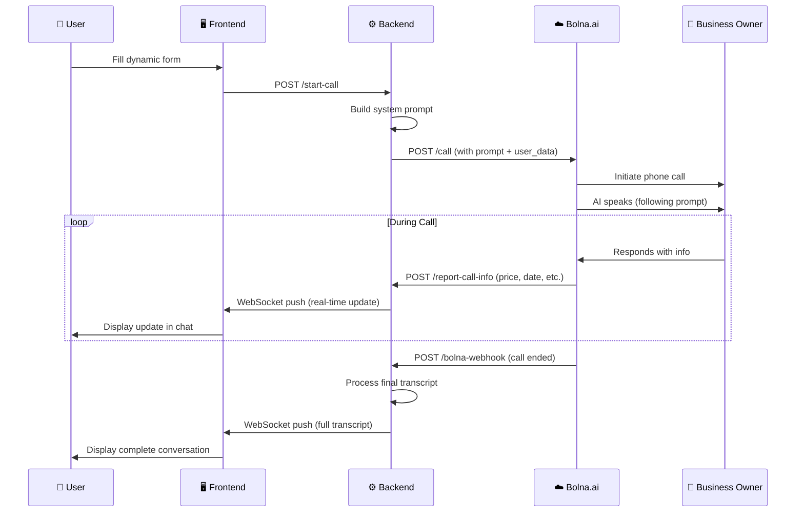

# AI-voice-agent
# 🤖 Bolna.ai Voice Agent System

[](https://fastapi.tiangolo.com)
[](https://python.org)
[](https://bolna.ai)
[](https://vapi.ai)
[](#)

> **A production-ready AI voice agent system that enables autonomous phone conversations with businesses on behalf of users. Built with FastAPI, Bolna.ai, and OpenAI, featuring real-time transcription, dynamic form generation, and intelligent conversation management.**

---

## 📑 Table of Contents

- [Overview](#-overview)
- [Key Features](#-key-features)
- [System Architecture](#-system-architecture)
- [Technology Stack](#-technology-stack)
- [Prerequisites](#-prerequisites)
- [Installation](#-installation)
- [Configuration](#-configuration)
- [Usage](#-usage)
- [API Documentation](#-api-documentation)
- [Project Structure](#-project-structure)
- [Core Components](#-core-components)
- [Deployment](#-deployment)
- [Troubleshooting](#-troubleshooting)
- [Performance Optimization](#-performance-optimization)
- [Contributing](#-contributing)

---

## 🎯 Overview

The Bolna.ai Voice Agent System is an intelligent voice automation platform that acts as a personal assistant for making phone calls. It handles everything from gathering user requirements through a dynamic form, building context-aware conversation prompts, initiating voice calls via Bolna.ai, and displaying real-time transcripts and conversation summaries.

### Use Cases

- **Service Inquiries**: Automatically call businesses to check availability, pricing, and schedules
- **Appointment Booking**: Schedule appointments with automated negotiation and confirmation
- **Price Negotiation**: Intelligent price negotiation within user-defined budget constraints
- **Information Gathering**: Collect structured information from business owners
- **Multi-language Support**: Communicate in the business owner's preferred language

---

## ✨ Key Features

### 🎨 Intelligent Form Generation
- **AI-Powered Dynamic Forms**: Uses GPT-4 to generate context-aware forms based on business type and user query
- **Business Context Integration**: Pulls business information from `data/business.txt` and user preferences from `data/user_preference.json`
- **Smart Prefilling**: Automatically prefills form fields with user preferences and business data
- **Adaptive Field Types**: Supports text, number, select, date, textarea, checkbox, and toggle inputs

### 📞 Voice Call Management
- **Bolna.ai Integration**: Leverages Bolna.ai's advanced voice AI platform for natural conversations
- **Real-time Call Control**: Start, stop, and monitor calls through WebSocket connections
- **Multiple Call Types**: 
  - **Info**: Information gathering only (no negotiation or booking)
  - **Negotiation**: Price negotiation within budget constraints
  - **Auto**: Automatic booking if price ≤ budget, with approval if price > budget
  - **Booking**: Always aims to book with user approval for prices > budget

### 🔴 Live Transcription & Updates
- **WebSocket-Based Streaming**: Real-time message updates during active calls
- **Dual-Source Transcription**:
  - Live updates via `report_call_info` function calls from the AI agent
  - Final complete transcript via Bolna.ai webhooks after call completion
- **Speaker Identification**: Clear distinction between AI agent and business owner messages
- **Structured Information Display**: Formatted display with emoji indicators for price, date, availability, etc.

### 🤝 Approval Workflow
- **Smart Approval System**: Requests user approval when AI negotiates prices above budget
- **Real-time Notifications**: Push notifications via WebSocket for approval requests
- **Timeout Handling**: Automatic timeout with configurable duration
- **Conditional Phone Sharing**: Share user phone number only after approval

### 🧠 Context-Aware Prompts
- **Dynamic Prompt Builder**: Generates custom system prompts based on:
  - Business type and services
  - User requirements and preferences
  - Call type (info/negotiation/auto/booking)
  - Special requests and urgency
- **Service Extraction**: Uses OpenAI to intelligently match user input to business services
- **Welcome Message Generation**: Creates natural, context-appropriate greetings

### 📊 Data Management
- **In-Memory Conversation Store**: Stores full conversation history for each call
- **Conversation Summaries**: AI-generated summaries of completed calls
- **Business Data Provider**: Structured parsing of business.txt with intelligent extraction
- **User Preference Management**: JSON-based user preference storage and retrieval

---

## 🏗 System Architecture



### Complete Call Flow



---

## 🔧 Technology Stack

| Category | Technology | Purpose |
|----------|-----------|---------|
| **Backend Framework** | FastAPI 0.104+ | High-performance async API server |
| **Voice AI** | Bolna.ai | AI voice agent platform with telephony integration |
| **LLM** | OpenAI GPT-4/GPT-4o-mini | Dynamic prompt generation, form generation, service extraction |
| **Real-time Communication** | WebSockets | Live transcript streaming and status updates |
| **Frontend** | HTML5 + Vanilla JS | Single-page application with modern UI |
| **Telephony** | Twilio (via Bolna.ai) | Phone call infrastructure |
| **HTTP Client** | HTTPX | Async HTTP requests to external APIs |
| **Environment Management** | python-dotenv | Environment variable configuration |
| **Data Serialization** | Pydantic 2.0+ | Data validation and parsing |

---

## 📋 Prerequisites

- **Python**: 3.8 or higher
- **Bolna.ai Account**: [Sign up at bolna.ai](https://bolna.ai)
- **OpenAI API Key**: [Get from platform.openai.com](https://platform.openai.com)
- **ngrok** (for development): [Download from ngrok.com](https://ngrok.com)
- **Virtual Environment**: Recommended for dependency isolation

---

## 🚀 Installation

### 1. Clone the Repository

```bash
git clone https://github.com/sihag06/AI-voice-calling-agent.git
cd voice_agent
```

### 2. Create Virtual Environment

```bash
# macOS/Linux
python3 -m venv venv
source venv/bin/activate

# Windows
python -m venv venv
venv\Scripts\activate
```

### 3. Install Dependencies

```bash
pip install -r requirements.txt
```

**requirements.txt contents:**
```
fastapi>=0.104.0
uvicorn[standard]>=0.24.0
httpx>=0.25.0
pydantic>=2.0.0
python-dotenv>=1.0.0
websockets>=12.0
openai>=1.0.0
```

### 4. Set Up Configuration

Create a `.env` file in the project root:

```bash
cp .env.example .env  # If example exists, or create manually
```

### 5. Configure Data Files

**`data/business.txt`**: Add your business information
```text
Business Name: Walk In Beauty Thai Spa

Overview:
Walk In Beauty Thai Spa is a modern Thai wellness spa...

Services:
Traditional Thai Massage, Aromatherapy, Body Scrubs...

Pricing:
₹1,200 - ₹1,500 per session

Location:
80 Feet Road, Indiranagar, Bengaluru

Contact:
Phone Number: 080 4150 1220
```

**`data/user_preference.json`**: Set default user preferences
```json
{
  "user_preferences": {
    "service_type": "Thai Massage",
    "price_range": {
      "min": 1000,
      "max": 1500
    },
    "session_duration_minutes": 60,
    "preferred_time": "10:00 PM"
  }
}
```

---

## ⚙️ Configuration

### Environment Variables (.env)

```bash
# Bolna.ai Configuration
BOLNA_API_KEY=bn-xxxxxxxxxxxxxxxxxxxxxxxx
BOLNA_ASSISTANT_ID=xxxxxxxx-xxxx-xxxx-xxxx-xxxxxxxxxxxx
BOLNA_PHONE_NUMBER_ID=xxxxxxxxxxxxxxxxxxxxxxxxxxxxxxxx

# OpenAI Configuration
OPENAI_API_KEY=sk-proj-xxxxxxxxxxxxxxxxxxxxxxxxxxxxxxxxxx
```

### Get Your API Keys

#### Bolna.ai Setup
1. Sign up at [bolna.ai](https://bolna.ai)
2. Create a new AI agent in the dashboard
3. Copy the **Agent ID** → `BOLNA_ASSISTANT_ID`
4. Go to Settings → API Keys → Copy **API Key** → `BOLNA_API_KEY`
5. Go to Phone Numbers → Copy **Phone Number ID** → `BOLNA_PHONE_NUMBER_ID`
6. Configure webhook URL in Bolna.ai dashboard:
   - Set webhook endpoint: `https://YOUR-NGROK-URL/bolna/server`
   - Add custom function `report_call_info` pointing to: `https://YOUR-NGROK-URL/report-call-info`

#### OpenAI Setup
1. Go to [platform.openai.com](https://platform.openai.com)
2. Navigate to API Keys
3. Create new secret key → `OPENAI_API_KEY`

---

## 🎮 Usage

### Development Mode

#### 1. Start the Backend Server

```bash
uvicorn main:app --reload
```

Server will start at `http://localhost:8000`

#### 2. Start ngrok (for Bolna.ai webhooks)

```bash
ngrok http 8000
```

Copy the HTTPS URL (e.g., `https://abc123.ngrok-free.app`)

#### 3. Update Bolna.ai Webhook URLs

In Bolna.ai dashboard, set:
- Main webhook: `https://abc123.ngrok-free.app/bolna/server`
- report_call_info function: `https://abc123.ngrok-free.app/report-call-info`

#### 4. Access the Application

Open your browser: `http://localhost:8000`

### Making a Call

1. **Fill the Dynamic Form**:
   - Service required (auto-generated based on business.txt)
   - Budget
   - Preferred date/time
   - Location
   - Special requests
   - Call type (info/negotiation/auto/booking)

2. **Click "Call on my behalf"**:
   - WebSocket connection established
   - Backend generates AI prompt
   - Call initiates via Bolna.ai

3. **Monitor Real-time Updates**:
   - See live transcript in chat interface
   - AI reports: prices, dates, availability
   - Receive approval requests if needed

4. **Review Completed Call**:
   - Full conversation transcript
   - AI-generated summary
   - Extracted structured information

---

## 📚 API Documentation

### Base URL
```
http://localhost:8000
```

### Endpoints

| Method | Endpoint | Description |
|--------|----------|-------------|
| `GET` | `/` | Serve main web application |
| `GET` | `/health` | Health check endpoint |
| `GET` | `/api/schema` | Get dynamic form schema |
| `POST` | `/api/schema` | Generate new form schema |
| `GET` | `/api/data/context` | Get business + user preference data |
| `POST` | `/api/data/refresh` | Reload data from files |
| `POST` | `/api/submit` | Submit form (legacy, redirects to /start-call) |
| `POST` | `/start-call` | Initiate a new voice call |
| `POST` | `/stop-call` | Terminate an active call |
| `WS` | `/ws/call/{call_id}` | WebSocket for real-time updates |
| `POST` | `/report-call-info` | Receive AI agent information reports |
| `POST` | `/bolna/server` | Bolna.ai webhook endpoint |
| `POST` | `/approve` | Approve a pending request |
| `POST` | `/deny` | Deny a pending request |
| `GET` | `/call/{call_id}/transcript` | Get call transcript |

### Start Call Request

**Endpoint**: `POST /start-call`

**Request Body**:
```json
{
  "user_name": "John Doe",
  "user_phone": "+919876543210",
  "business_owner_phone": "+918041501220",
  "service": "Thai Massage",
  "requirement": "60-minute traditional Thai massage",
  "budget": 1500,
  "preferred_date": "2026-03-15",
  "preferred_call_time": "Evening",
  "location": "Indiranagar, Bengaluru",
  "notes": "Prefer deep tissue massage",
  "special_requests": ["Weekend availability", "Female therapist"],
  "call_type": "auto",
  "urgency": "Normal"
}
```

**Response**:
```json
{
  "status": "success",
  "call_id": "550e8400-e29b-41d4-a716-446655440000",
  "message": "Call initiated successfully. Monitor via WebSocket."
}
```

### WebSocket Message Types

#### Conversation Update
```json
{
  "type": "conversation_update",
  "speaker": "AI" | "Owner" | "SYSTEM",
  "text": "Hello, I'm calling to inquire about...",
  "index": 0,
  "partial": false,
  "is_info_update": false
}
```

#### Info Update (from report_call_info)
```json
{
  "type": "conversation_update",
  "speaker": "SYSTEM",
  "text": "💰 Price: ₹1500",
  "is_info_update": true,
  "info_type": "price",
  "info_status": "checking"
}
```

#### Approval Request
```json
{
  "type": "approval_request",
  "call_id": "550e8400-e29b-41d4-a716-446655440000",
  "approval_type": "price_negotiation",
  "description": "Owner quoted ₹1800, which is above your budget",
  "original_value": "₹1500",
  "negotiated_value": "₹1800",
  "user_budget": 1500
}
```

#### Summary
```json
{
  "type": "summary",
  "text": "The business owner confirmed availability for March 15th..."
}
```

---

## 📁 Project Structure

```
voice_agent/
├── main.py                          # Bolna.ai FastAPI backend (2700+ lines)
├── data_provider.py                 # Business & user preference data provider
├── prompt_builder.py                # Dynamic system prompt generator
├── bolna_client.py                  # Bolna.ai API client (PATCH /v2/agent)
├── live_transcript.py               # Webhook-based real-time transcript handler
├── requirements.txt                 # Python dependencies
├── .env.example                     # Environment variable template (copy to .env)
├── .gitignore                       # Excludes secrets, venvs, cache
├── data/
│   ├── business.txt                 # Business information for prompt context
│   └── user_preference.json         # Default user preferences
├── static/
│   └── index.html                   # Frontend single-page application
├── Vapi_voice_agent/
│   ├── main.py                      # Vapi.ai FastAPI backend (2100+ lines)
│   └── .env.example                 # Vapi environment variable template
├── CALL_FLOW_DIAGRAM.md             # Visual call flow documentation
├── INTERNSHIP_REPORT.md             # Full internship analysis report
└── REPORT_CALL_INFO_README.md       # report_call_info function documentation
```

---

## 🧩 Core Components

### 1. Dynamic Form Generator (`main.py`)

Uses OpenAI GPT-4o-mini to generate business-specific forms:

```python
def generate_schema_from_query(query: str) -> dict:
    """
    Generate a form schema using ChatGPT with business data context.
    
    Combines:
    1. Business information from data/business.txt
    2. User preferences from data/user_preference.json
    3. The user's query
    
    Returns: JSON schema for dynamic form
    """
```

**Features**:
- Context-aware field generation
- Business-specific service options
- Smart field type selection (text, number, select, date, etc.)
- Prefilled placeholders from business/user data

### 2. Prompt Builder (`prompt_builder.py`)

Constructs comprehensive system prompts for the AI voice agent:

```python
def build_dynamic_prompt(
    form_data: dict,
    business_info: BusinessInfo,
    call_type: str = "info"
) -> str:
    """
    Builds a comprehensive system prompt for bolna.ai voice agents.
    
    Call Types:
    - info: Information gathering only
    - negotiation: Price negotiation only
    - auto: Auto-book if price <= budget, approval if > budget
    - booking: Always aim to book, approval required if > budget
    """
```

**Key Sections**:
- Agent role and identity (name: "Alex")
- Business context and user information
- Tool usage instructions (`@report_call_info`, `@request_user_approval`)
- Conversation flow (availability → price → negotiation → booking)
- Strict behavior rules and failure conditions

### 3. Data Provider (`data_provider.py`)

Intelligent parsing of business information:

```python
def get_business_info(force_reload: bool = False) -> BusinessInfo:
    """
    Read data/business.txt and return BusinessInfo object.
    Uses OpenAI for intelligent extraction from unstructured text.
    Falls back to simple parsing if OpenAI unavailable.
    """
```

**Business Info Structure**:
```python
@dataclass
class BusinessInfo:
    name: str
    location: str
    business_overview: str
    services: List[str]
    price_range: str
    availability: str
    phone: str
    feedback: str
    additional_info: Dict[str, Any]
```

### 4. Live Transcript Handler (`live_transcript.py`)

Manages real-time transcript streaming:

```python
class LiveTranscriptHandler:
    """
    Handles live transcript streaming from Bolna.ai using webhooks.
    
    Features:
    - Webhook-based transcript processing
    - Speaker identification (AI vs Owner)
    - Message deduplication
    - WebSocket broadcasting to frontend
    """
```

**Processing Flow**:
1. Receive webhook from Bolna.ai
2. Parse transcript string format: `"assistant: Hello\nuser: Yes..."`
3. Normalize and deduplicate messages
4. Send via WebSocket to frontend

### 5. Bolna Client (`bolna_client.py`)

Clean API interface to Bolna.ai platform:

```python
class BolnaClient:
    async def update_agent_prompt(
        self,
        agent_id: str,
        system_prompt: str,
        welcome_message: Optional[str] = None
    ) -> bool:
        """
        Update an agent's system prompt via PATCH /v2/agent/{agent_id}
        """
```

---

## 🔀 Vapi.ai Integration (`Vapi_voice_agent/`)

A parallel implementation using [Vapi.ai](https://vapi.ai) as the voice platform — built to compare capabilities against Bolna.ai.

### Key Differences vs Bolna.ai

| Feature | Bolna.ai | Vapi.ai |
|---------|----------|---------|
| **ASR** | Bolna native (Indian-optimised) | Deepgram `nova-2 multi` |
| **Prompt Injection** | `PATCH /v2/agent` API | `assistantOverrides` in call payload |
| **Function Callbacks** | `@function_name` webhooks | `tool-calls` webhook events |
| **Control API** | Not available | `say`, `transfer`, `hangup` actions |
| **Handoff** | Manual | Native warm call transfer |
| **Telephony** | Exotel / Twilio via Bolna | Direct Twilio via Vapi |

### Vapi-Exclusive Features

- **Real-time price negotiation** with `request_user_approval` function calling
- **Warm call transfer** (`request_human_handoff`) — connects business owner directly to user
- **Vapi Control API** — inject `say` messages mid-call, force `hangup`, trigger `transfer`
- **WhatsApp post-call summary** — sends structured summary via WhatsApp after call ends
- **3 handoff modes**: `join_when_needed` · `ask_before_joining` · `ai_only`

### Run the Vapi Agent

```bash
cd Vapi_voice_agent
cp .env.example .env   # Fill in VAPI_API_KEY, VAPI_ASSISTANT_ID, VAPI_PHONE_NUMBER_ID
uvicorn main:app --reload --port 8001
```

### 6. WebSocket Connection Manager (`main.py`)

Manages real-time connections:

```python
class ConnectionManager:
    def __init__(self):
        self.active_connections: Dict[str, WebSocket] = {}
        self.bolna_to_app_call: Dict[str, str] = {}
        self.app_call_control_url: Dict[str, str] = {}
        self.call_message_cursors: Dict[str, int] = {}
        self.message_content_hashes: Dict[str, Dict[int, str]] = {}
    
    async def send_to_app_call(self, call_id: str, message: dict):
        """Send real-time updates to frontend via WebSocket"""
```

---

## 🚢 Deployment

### Production Deployment with Docker

**Dockerfile**:
```dockerfile
FROM python:3.10-slim

WORKDIR /app

COPY requirements.txt .
RUN pip install --no-cache-dir -r requirements.txt

COPY . .

EXPOSE 8000

CMD ["uvicorn", "main:app", "--host", "0.0.0.0", "--port", "8000"]
```

**Build and Run**:
```bash
docker build -t bolna-voice-agent .
docker run -p 8000:8000 --env-file .env bolna-voice-agent
```

### Deployment on Cloud Platforms

#### Heroku
```bash
# Install Heroku CLI
heroku login
heroku create your-app-name
git push heroku main
heroku config:set BOLNA_API_KEY=xxx OPENAI_API_KEY=xxx
```

#### Railway
1. Connect GitHub repository
2. Add environment variables in Railway dashboard
3. Deploy automatically from main branch

#### Render
1. Create new Web Service
2. Connect repository
3. Set build command: `pip install -r requirements.txt`
4. Set start command: `uvicorn main:app --host 0.0.0.0 --port $PORT`

### Production Considerations

- **HTTPS**: Use proper SSL certificates (not ngrok in production)
- **Environment Variables**: Use secrets management (AWS Secrets Manager, HashiCorp Vault)
- **Logging**: Implement structured logging (loguru, structlog)
- **Monitoring**: Add application monitoring (Sentry, Datadog, New Relic)
- **Rate Limiting**: Implement API rate limiting
- **Database**: Migrate from in-memory storage to PostgreSQL/MongoDB
- **Caching**: Add Redis for session management
- **Load Balancing**: Use nginx or cloud load balancers for horizontal scaling

---

## 🐛 Troubleshooting

### Common Issues

#### 1. Bolna.ai Webhook Not Receiving Data

**Symptoms**: No transcript updates, no real-time info

**Solutions**:
```bash
# Verify ngrok is running
ngrok http 8000

# Check ngrok URL is set in Bolna.ai dashboard
# Test webhook endpoint manually:
curl -X POST https://your-ngrok-url/bolna/server \
  -H "Content-Type: application/json" \
  -d '{"test": true}'
```

#### 2. OpenAI API Errors

**Symptoms**: Form generation fails, falls back to default schema

**Solutions**:
```bash
# Verify API key is valid
echo $OPENAI_API_KEY

# Check OpenAI account has credits
# Monitor terminal logs for error messages
```

#### 3. WebSocket Connection Issues

**Symptoms**: Frontend shows "Connecting..." indefinitely

**Solutions**:
- Check browser console for WebSocket errors
- Verify FastAPI server is running
- Ensure `/ws/call/{call_id}` endpoint is accessible
- Check firewall/proxy settings

#### 4. "Could not find CallerId" Error

**Symptoms**: Bolna.ai rejects call initiation

**Solutions**:
```python
# Verify BOLNA_PHONE_NUMBER_ID in .env is correct
# Check Bolna.ai dashboard → Phone Numbers → Copy exact ID
# Ensure phone number is verified and active
```

### Debug Mode

Enable detailed logging:

```python
# In main.py, add at the top:
import logging
logging.basicConfig(level=logging.DEBUG)

# Monitor terminal output for detailed logs
```

### Health Check Endpoint

```bash
curl http://localhost:8000/health
# Expected: {"status": "ok"}
```

---

## ⚡ Performance Optimization

### Recommended Optimizations

1. **Connection Pooling**:
```python
# Use connection pooling for HTTPX
client = httpx.AsyncClient(
    limits=httpx.Limits(max_keepalive_connections=5, max_connections=10)
)
```

2. **Caching**:
```python
# Cache business info and user preferences
from functools import lru_cache

@lru_cache(maxsize=1)
def get_cached_business_info():
    return get_business_info()
```

3. **Async Operations**:
```python
# Already implemented - all I/O operations use async/await
# Bolna API calls, OpenAI calls, WebSocket operations
```

4. **Database Migration**:
```python
# Replace in-memory stores with Redis/PostgreSQL
# Current: conversation_store: Dict[str, list] = {}
# Production: Use SQLAlchemy with PostgreSQL
```

---

## 🤝 Contributing

Contributions are welcome! Please follow these guidelines:

1. Fork the repository
2. Create a feature branch: `git checkout -b feature/amazing-feature`
3. Commit changes: `git commit -m 'Add amazing feature'`
4. Push to branch: `git push origin feature/amazing-feature`
5. Open a Pull Request

### Development Setup

```bash
# Install dev dependencies
pip install -r requirements-dev.txt

# Run tests
pytest tests/

# Format code
black .
isort .

# Lint
flake8 .
```

---


## 🙏 Acknowledgments

- [Bolna.ai](https://bolna.ai) - AI voice agent platform
- [OpenAI](https://openai.com) - GPT-4 for intelligent prompt generation
- [FastAPI](https://fastapi.tiangolo.com) - High-performance web framework
- [Twilio](https://twilio.com) - Telephony infrastructure

---

## 📞 Support

For issues and questions:
- Open an issue on GitHub
- Check existing documentation in `CALL_FLOW_DIAGRAM.md` and `REPORT_CALL_INFO_README.md`
- Review Bolna.ai documentation: [docs.bolna.ai](https://docs.bolna.ai)

---

## 🗺️ Roadmap

- [ ] Add support for multiple languages
- [ ] Implement call recording and playback
- [ ] Add analytics dashboard for call metrics
- [ ] Integrate with CRM systems (Salesforce, HubSpot)
- [ ] Support for group/conference calls
- [ ] Voice cloning for personalized AI voices
- [ ] Sentiment analysis during calls
- [ ] Automated follow-up scheduling

---

<p align="center">
  <strong>Built with ❤️ using Bolna.ai, OpenAI, and FastAPI</strong>
</p>

<p align="center">
  <sub>Last updated: March 2026</sub>
</p>

