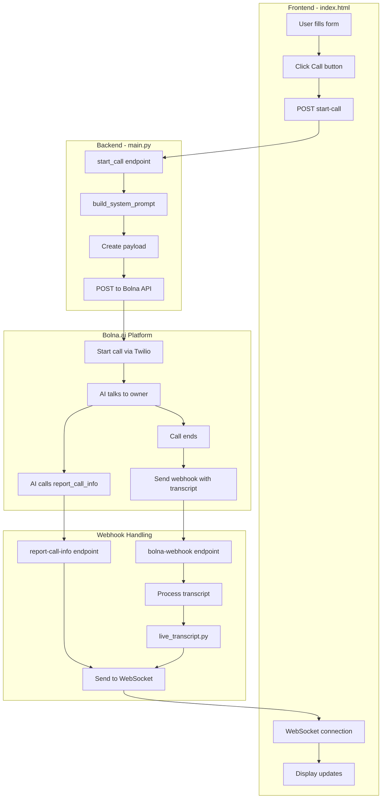
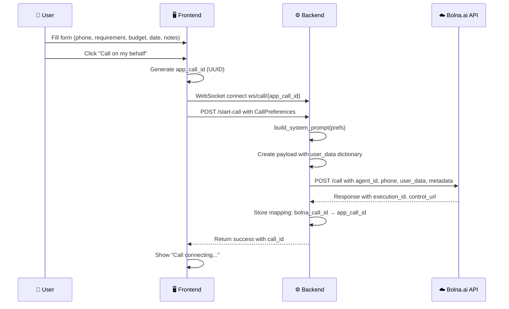
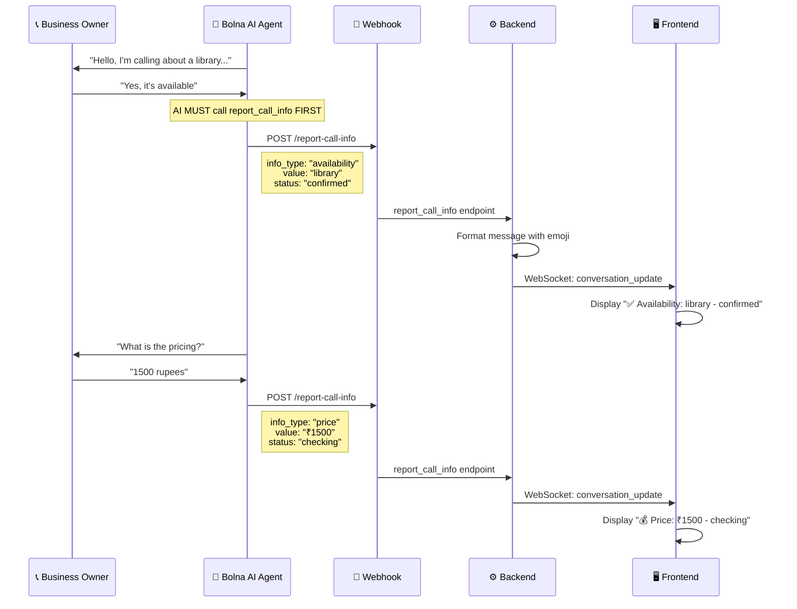
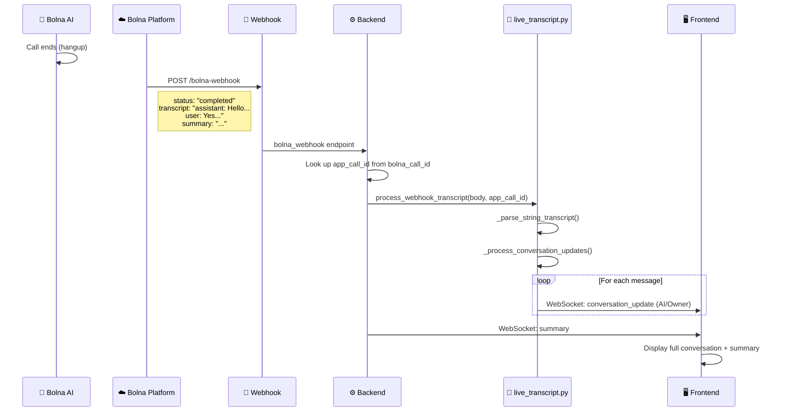
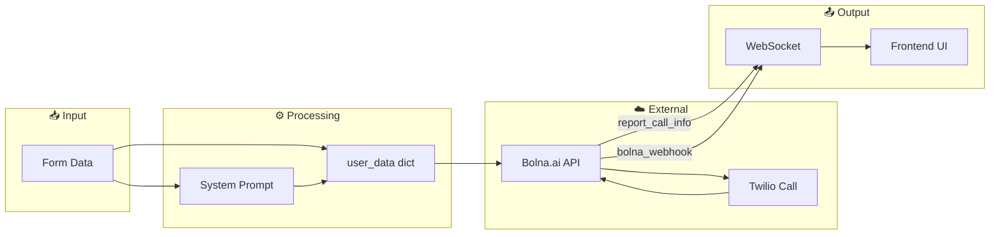

# 🔄 Complete Call Flow Diagram

> **Visual guide showing every step from call initiation to completion**

---

## 📊 High-Level Overview

---

## 📋 Step-by-Step Flow

### Phase 1: Call Initiation

### Phase 2: During Call (Real-time Updates)

### Phase 3: Call Ends (Final Transcript)

---

## 🗂️ File Responsibilities

| File | Responsibility |
|------|----------------|
| `main.py` | API endpoints, webhook handling, system prompt |
| `live_transcript.py` | Parse and send final transcript to frontend |
| `static/index.html` | UI, WebSocket connection, display updates |

---

## 📡 API Endpoints

| Endpoint | Method | Purpose | Called By |
|----------|--------|---------|-----------|
| `/start-call` | POST | Start a new call | Frontend |
| `/stop-call` | POST | End an active call | Frontend |
| `/report-call-info` | POST | Receive real-time info | Bolna AI |
| `/bolna-webhook` | POST | Receive call events | Bolna Platform |
| `/ws/call/{id}` | WS | Real-time updates | Frontend |

---

## 🔧 Key Functions

### `build_system_prompt(prefs)` - Lines 448-710
Creates the AI agent's instructions including:
- Real-time reporting requirements
- Conversation flow (availability → price → negotiate)
- Pronunciation rules
- Identity and behavior rules

### `start_call()` - Lines 705-835
1. Generates `app_call_id`
2. Builds `user_data` dictionary with form values + system_prompt
3. Calls Bolna.ai `/call` API
4. Stores call mappings
5. Returns call_id to frontend

### `report_call_info()` - Lines 1191-1290
1. Receives info from AI agent
2. Formats with emoji based on `info_type`
3. Sends to frontend via WebSocket

### `bolna_webhook()` - Lines 1530-1720
1. Receives all Bolna.ai events
2. Routes to appropriate handler
3. Processes final transcript when call ends
4. Sends summary to frontend

### `process_webhook_transcript()` - live_transcript.py
1. Parses transcript string
2. Converts to structured messages
3. Sends each message to frontend via WebSocket

---

## 📊 Data Flow Diagram

---

## ✅ Summary

1. **User fills form** → Frontend sends to `/start-call`
2. **Backend builds prompt** → Calls Bolna.ai API with `user_data`
3. **Bolna.ai calls business** → AI agent talks via Twilio
4. **AI reports updates** → `report_call_info` → WebSocket → Frontend
5. **Call ends** → `bolna_webhook` → `live_transcript.py` → WebSocket → Frontend
6. **User sees everything** → Real-time updates + final transcript + summary
