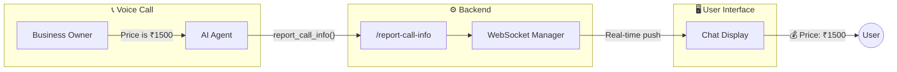
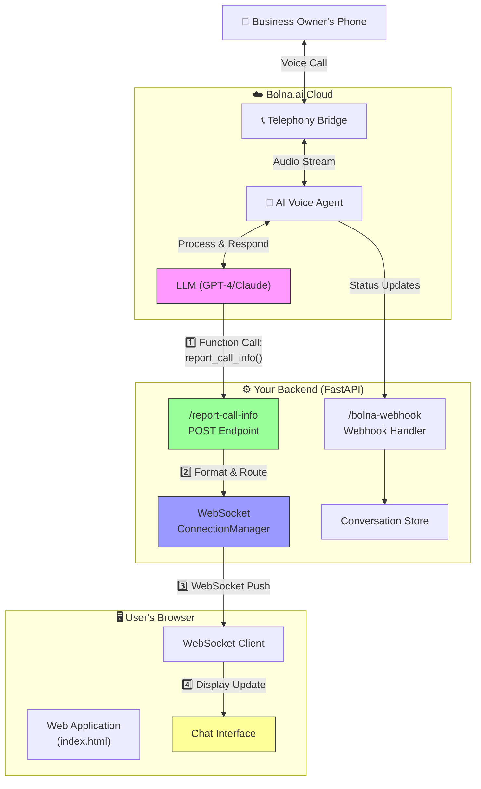
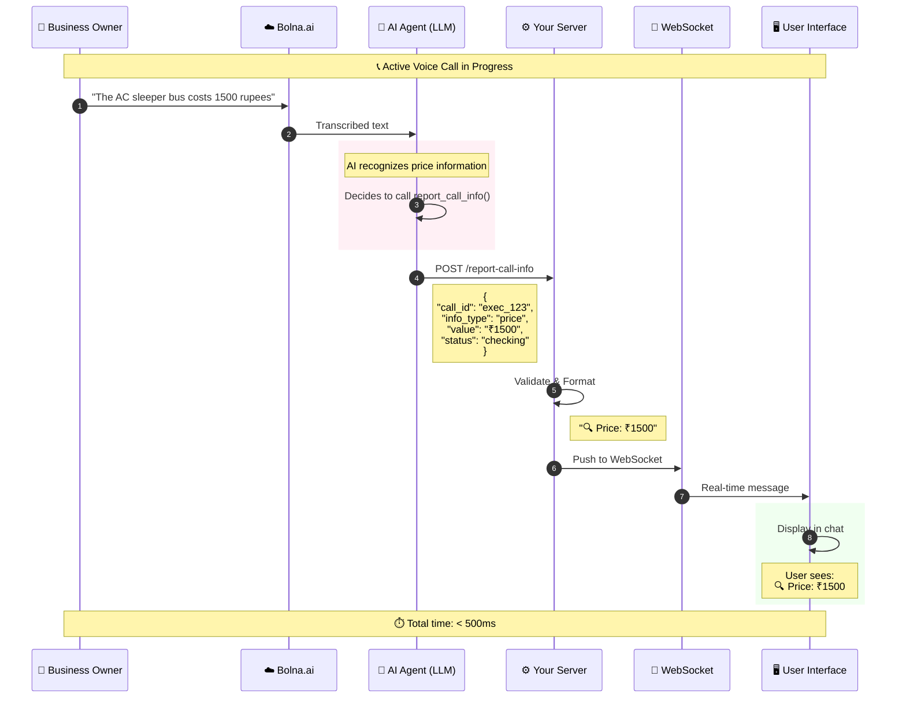
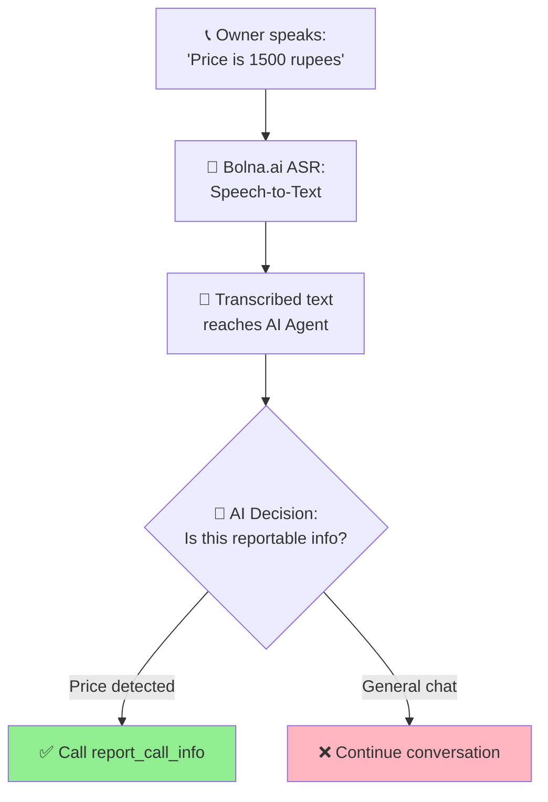
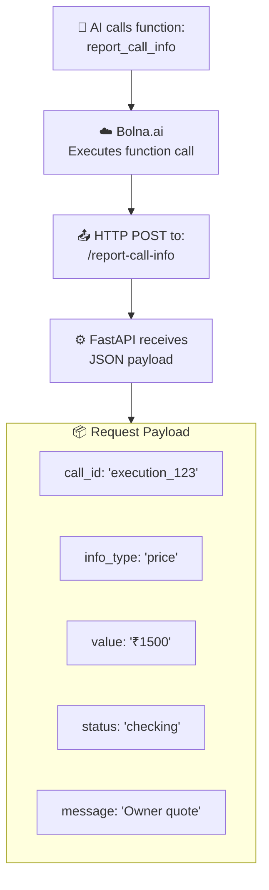
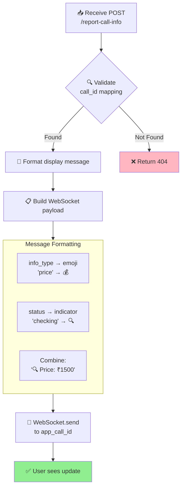
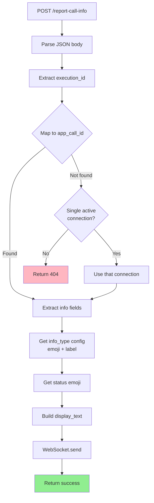
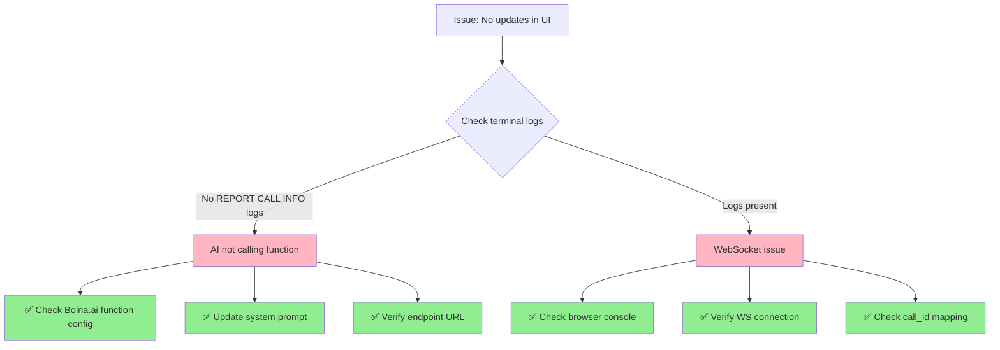
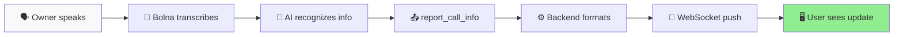

# 📊 Real-Time Call Information System (`report_call_info`)

[](https://bolna.ai)
[](#)
[](https://fastapi.tiangolo.com)

> **The `report_call_info` function is the core mechanism for real-time information display during voice calls.** When the AI agent hears important information (price, date, availability), it immediately pushes that data to the user's interface.

---

## 📑 Table of Contents

- [Overview](#-overview)
- [Why report_call_info?](#-why-report_call_info)
- [System Architecture](#-system-architecture)
- [Complete Data Flow](#-complete-data-flow)
- [Step-by-Step Workflow](#-step-by-step-workflow)
- [Function Schema](#-function-schema)
- [Backend Implementation](#-backend-implementation)
- [Bolna.ai Configuration](#-bolnaai-configuration)
- [Frontend Integration](#-frontend-integration)
- [Display Examples](#-display-examples)
- [Debugging Guide](#-debugging-guide)

---

## 🎯 Overview

The `report_call_info` function enables **real-time bidirectional communication** between the AI voice agent (running on Bolna.ai) and the user's web interface.



---

## 🤔 Why `report_call_info`?

| Approach | Problem | Solution |
|----------|---------|----------|
| ❌ Polling for transcript | Slow, misses real-time updates | ✅ Push-based via function call |
| ❌ Wait for call to end | User has no visibility during call | ✅ Instant updates as AI hears info |
| ❌ Complex parsing of raw transcript | Unstructured, hard to extract | ✅ AI sends structured data |

**Key Benefits:**
- ⚡ **Instant**: Updates appear within milliseconds
- 📋 **Structured**: Pre-categorized data (price, date, availability)
- 🎯 **Accurate**: AI decides what's relevant to report
- 🔄 **Bidirectional**: WebSocket enables real-time push

---

## 🏗 System Architecture



---

## 🔄 Complete Data Flow

This sequence diagram shows the complete journey of a single piece of information from the business owner's voice to the user's screen:



---

## 📝 Step-by-Step Workflow

### Phase 1: Voice Recognition & AI Processing



### Phase 2: Function Call Execution



### Phase 3: Backend Processing & WebSocket Push



---

## 📐 Function Schema

### Complete Function Definition for Bolna.ai

```json
{
  "name": "report_call_info",
  "description": "📊 REAL-TIME INFO: Report important information to the user during the call. Call this IMMEDIATELY when you hear price, date availability, or service confirmations.",
  "pre_call_message": "",
  "parameters": {
    "type": "object",
    "required": ["call_id", "info_type", "value", "status"],
    "properties": {
      "call_id": {
        "type": "string",
        "description": "The call session ID. Use the {call_sid} context variable."
      },
      "info_type": {
        "enum": ["price", "date", "availability", "requirement", "negotiation", "status"],
        "type": "string",
        "description": "Category of information being reported"
      },
      "value": {
        "type": "string",
        "description": "The actual value (e.g., '₹1500', 'March 15th available', 'AC Sleeper confirmed')"
      },
      "status": {
        "enum": ["confirmed", "not_available", "checking", "negotiating", "waiting"],
        "type": "string",
        "description": "Current status of this information"
      },
      "message": {
        "type": "string",
        "description": "Optional brief context or note"
      }
    }
  },
  "key": "custom_task",
  "value": {
    "method": "POST",
    "param": {
      "call_id": "%(call_id)s",
      "info_type": "%(info_type)s",
      "value": "%(value)s",
      "status": "%(status)s",
      "message": "%(message)s"
    },
    "url": "https://YOUR-NGROK-URL/report-call-info",
    "api_token": null,
    "headers": {
      "Content-Type": "application/json"
    }
  }
}
```

### Parameter Reference

| Parameter | Type | Required | Description | Example Values |
|-----------|------|----------|-------------|----------------|
| `call_id` | string | ✅ | Bolna execution ID | `{call_sid}` context variable |
| `info_type` | enum | ✅ | Category of info | `price`, `date`, `availability` |
| `value` | string | ✅ | The actual information | `₹1500`, `March 15th`, `AC Sleeper` |
| `status` | enum | ✅ | Status indicator | `confirmed`, `checking`, `not_available` |
| `message` | string | ❌ | Additional context | `Owner's initial quote` |

---

## 💻 Backend Implementation

### Endpoint Code (`main.py`)

```python
@app.post("/report-call-info")
async def report_call_info(request: Request):
    """
    Receive real-time call info from Bolna.ai AI agent.
    Displays information as TEXT messages in the chat.
    """
    body = await request.json()
    
    # Extract execution_id and map to app_call_id
    execution_id = body.get("call_id") or body.get("execution_id")
    app_call_id = manager.bolna_to_app_call.get(execution_id)
    
    if not app_call_id:
        # Fallback: use single active connection if available
        if len(manager.active_connections) == 1:
            app_call_id = list(manager.active_connections.keys())[0]
        else:
            return {"status": "error", "message": "Cannot find active call"}, 404
    
    # Extract info details
    info_type = body.get("info_type", "status").lower()
    value = body.get("value", "")
    status = body.get("status", "checking").lower()
    message = body.get("message", "")
    
    # Map info_type to emoji and label
    type_config = {
        "price": {"emoji": "💰", "label": "Price"},
        "date": {"emoji": "📅", "label": "Date"},
        "availability": {"emoji": "✅", "label": "Availability"},
        "requirement": {"emoji": "📋", "label": "Requirement"},
        "status": {"emoji": "ℹ️", "label": "Status"},
        "negotiation": {"emoji": "🤝", "label": "Negotiation"}
    }
    
    config = type_config.get(info_type, {"emoji": "ℹ️", "label": info_type.title()})
    
    # Map status to visual indicator
    status_emoji = {
        "confirmed": "✅",
        "not_available": "❌",
        "checking": "🔍",
        "negotiating": "🤝",
        "waiting": "⏳"
    }.get(status, "ℹ️")
    
    # Build display text
    display_text = f"{status_emoji} {config['label']}: {value}"
    if message:
        display_text += f" - {message}"
    
    # Send via WebSocket
    await manager.send_to_app_call(app_call_id, {
        "type": "conversation_update",
        "speaker": "SYSTEM",
        "text": display_text,
        "is_info_update": True,
        "info_type": info_type,
        "info_status": status
    })
    
    return {"status": "ok", "message": "Info sent to frontend"}
```

### Processing Flow Diagram



---

## ⚙️ Bolna.ai Configuration

### System Prompt Instructions

Add this to your Bolna.ai agent's system prompt to ensure the AI calls `report_call_info`:

```text
🚨🚨🚨 #1 PRIORITY - REAL-TIME INFORMATION REPORTING 🚨🚨🚨

YOU HAVE A FUNCTION: report_call_info
THIS IS YOUR #1 PRIORITY - CALL IT IMMEDIATELY!

⚡ When to call report_call_info:

1. 💰 PRICE MENTIONED
   - Owner says any price/cost/rate
   - Example: "1500 rupees" → call with info_type="price", value="₹1500"

2. 📅 DATE CONFIRMED/DENIED  
   - Owner confirms or denies date availability
   - Example: "March 15 available" → call with info_type="date", status="confirmed"

3. ✅ SERVICE AVAILABILITY
   - Owner confirms what's available
   - Example: "AC sleeper available" → call with info_type="availability"

4. 🤝 NEGOTIATION UPDATE
   - When negotiating price
   - Example: "Can do 1200" → call with info_type="negotiation"

⚠️ CRITICAL: Call report_call_info BEFORE responding to the owner!
```

### Webhook URL Configuration

In your Bolna.ai dashboard:
1. Go to **Agent Settings** → **Custom Functions**
2. Set the endpoint URL to: `https://your-ngrok-url.ngrok-free.app/report-call-info`
3. Ensure the function is enabled

---

## 🖥️ Frontend Integration

### WebSocket Message Handler (`index.html`)

```javascript
websocket.onmessage = function(event) {
    const data = JSON.parse(event.data);
    
    if (data.type === 'conversation_update') {
        // Create message element
        const messageDiv = document.createElement('div');
        messageDiv.className = 'chat-message';
        
        // Style info updates differently
        if (data.is_info_update) {
            messageDiv.classList.add('info-update');
            messageDiv.classList.add(`info-${data.info_type}`);
            messageDiv.classList.add(`status-${data.info_status}`);
        }
        
        // Set speaker label
        const speakerSpan = document.createElement('span');
        speakerSpan.className = 'speaker';
        speakerSpan.textContent = data.speaker;
        
        // Set message text
        const textSpan = document.createElement('span');
        textSpan.className = 'text';
        textSpan.textContent = data.text;
        
        messageDiv.appendChild(speakerSpan);
        messageDiv.appendChild(textSpan);
        chatContainer.appendChild(messageDiv);
        
        // Auto-scroll to bottom
        chatContainer.scrollTop = chatContainer.scrollHeight;
    }
};
```

### CSS Styling for Info Updates

```css
.info-update {
    background: linear-gradient(135deg, #f0f9ff 0%, #e0f2fe 100%);
    border-left: 4px solid #3b82f6;
    padding: 12px 16px;
    margin: 8px 0;
    border-radius: 8px;
}

.info-update.status-confirmed {
    border-left-color: #10b981;
    background: linear-gradient(135deg, #ecfdf5 0%, #d1fae5 100%);
}

.info-update.status-not_available {
    border-left-color: #ef4444;
    background: linear-gradient(135deg, #fef2f2 0%, #fee2e2 100%);
}

.info-update.status-negotiating {
    border-left-color: #f59e0b;
    background: linear-gradient(135deg, #fffbeb 0%, #fef3c7 100%);
}
```

---

## 📊 Display Examples

### Visual Examples

| Scenario | WebSocket Message | Display |
|----------|-------------------|---------|
| Owner quotes price | `{info_type: "price", value: "₹1500", status: "checking"}` | 🔍 Price: ₹1500 |
| Price confirmed | `{info_type: "price", value: "₹1200", status: "confirmed"}` | ✅ Price: ₹1200 |
| Date available | `{info_type: "date", value: "March 15th", status: "confirmed"}` | ✅ Date: March 15th |
| Date unavailable | `{info_type: "date", value: "March 15th", status: "not_available"}` | ❌ Date: March 15th |
| Service confirmed | `{info_type: "availability", value: "AC Sleeper", status: "confirmed"}` | ✅ Availability: AC Sleeper |
| Negotiating | `{info_type: "negotiation", value: "₹1500 → ₹1200", status: "negotiating"}` | 🤝 Negotiation: ₹1500 → ₹1200 |

### Status Icons Reference

| Status | Icon | Meaning |
|--------|------|---------|
| `confirmed` | ✅ | Information is confirmed |
| `not_available` | ❌ | Not available/rejected |
| `checking` | 🔍 | Initial information, verifying |
| `negotiating` | 🤝 | Active negotiation |
| `waiting` | ⏳ | Waiting for response |

---

## 🔧 Debugging Guide

### Expected Terminal Logs

When `report_call_info` is working correctly:

```
================================================================================
[REPORT CALL INFO] 📊 RECEIVED REAL-TIME INFO FROM AI AGENT
[REPORT CALL INFO] Full body: {
  "call_id": "execution_abc123",
  "info_type": "price",
  "value": "₹1500",
  "status": "checking",
  "message": "Owner's initial quote"
}
================================================================================
[REPORT CALL INFO] Mapped to app_call_id: uuid-xyz-789
[REPORT CALL INFO] ✅ Sent to frontend: 🔍 Price: ₹1500 - Owner's initial quote
```

### Common Issues & Solutions



### Checklist for Troubleshooting

- [ ] ngrok is running and URL is updated in Bolna.ai
- [ ] Function `report_call_info` is configured in Bolna.ai dashboard
- [ ] System prompt instructs AI to call the function
- [ ] Backend server is running (`uvicorn main:app --reload`)
- [ ] WebSocket connection is established (check browser Network tab)
- [ ] `call_id` mapping exists (check terminal logs)

---

## 📁 Related Files

| File | Lines | Description |
|------|-------|-------------|
| `main.py` | 1309-1415 | `/report-call-info` endpoint implementation |
| `main.py` | 476-600 | System prompt with function call instructions |
| `static/index.html` | 600-700 | WebSocket message handler |
| `live_transcript.py` | 100-200 | Webhook processing (separate from report_call_info) |

---

## 🎯 Summary



**The `report_call_info` function provides real-time visibility into the call, allowing users to see exactly what the AI is learning - instant updates, structured data, and a seamless user experience.**

---

<p align="center">
  <strong>Built for real-time voice AI applications</strong>
</p>
